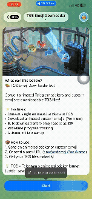
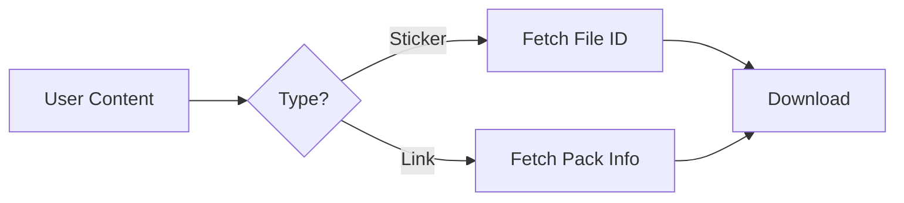

<p style="text-align:center;" align="center">
  
</p>
<h1 align="center">📦 TGS Emoji Downloader Bot</h1>

<div align="center">

[](https://www.python.org/)
[](LICENSE)
[](https://t.me/SadadakaWijerathna)

</div>

<h4 align="center">Download Animated Stickers & Custom Emojis in TGS Format! 🚀✨</h4>

<div align="center">
  - High-performance Telegram bot to convert animated content into downloadable TGS files -
  <br/>
  <sup><sub>Built with Python and python-telegram-bot ツ</sub></sup>
</div>

## 🎯 Features

- 🖼️ **Single Sticker Conversion** - Instantly convert any animated sticker to a `.tgs` file
- 🌟 **Custom Emoji Support** - Download premium animated custom emojis as `.tgs`
- 📦 **Bulk Pack Download** - Download entire emoji or sticker packs as a single ZIP archive
- 📊 **Real-time Progress** - Visual progress bars and ETA for large pack downloads
- 🗜️ **Optimized Packaging** - Efficient ZIP compression and file naming
- 💾 **Disk Management** - Smart cleanup of old files and disk space monitoring
- 🐳 **Docker Ready** - Easy deployment with Docker (coming soon)
- ☁️ **Cloud Compatible** - Deploy to Railway, Heroku, Render, and more

## 🎬 Demo

  
  <br/>
  <sup><i>(Tip: Send any animated sticker to the bot to see it in action!)</i></sup>

## 🚀 Quick Start

### Prerequisites

- **Python 3.10+**
- **Bot Token**: Get it from [@BotFather](https://t.me/BotFather)

### Option 1: Local Development

```bash
# Clone the repository
git clone https://github.com/Sadaka-Wijerathna/tgs-downloader-bot.git
cd tgs-downloader-bot

# Install dependencies
pip install -r requirements.txt

# Configure environment
cp .env.example .env
# Edit .env and add your TELEGRAM_BOT_TOKEN
```

### Option 2: Running the Bot

```bash
python bot.py
```

## ☁️ Deploy to Cloud

### 🚀 One-Click Deploy

[](https://railway.app/template/nixpacks?referrer=https://github.com/Sadaka-Wijerathna/tgs-downloader-bot)
[](https://www.heroku.com/deploy?template=https://github.com/Sadaka-Wijerathna/tgs-downloader-bot)

### 🔨 Manual Deployment (Generic VPS)

1. Clone the repo and install dependencies (as shown in Quick Start).
2. Set up a process manager like **PM2** or a **Systemd** service to keep the bot running.
3. Ensure the `downloads/` directory has write permissions.

---

## ⚙️ Configuration

### Environment Variables

| Variable | Required | Description | Default |
|----------|----------|-------------|---------|
| `TELEGRAM_BOT_TOKEN` | ✅ Yes | Bot token from @BotFather | - |
| `DOWNLOADS_DIR` | ❌ No | Directory for temp files | `downloads` |
| `CLEANUP_AGE_HOURS` | ❌ No | File deletion threshold | `1` |
| `LOG_LEVEL` | ❌ No | Logging verbosity | `INFO` |

---

## 📖 Usage

### In Private Chat

1. **Send any animated sticker** to the bot.
2. The bot will processing it and send back the **.tgs file**.
3. **Send a custom emoji** (Premium) to get its file.
4. **Send a pack URL** (e.g., `t.me/addemoji/PackName`) to download the whole pack.

### In Groups

The bot can be added to groups to help members download stickers:
- Send a sticker to the group (if the bot has access to messages).
- Reply to a sticker with a command (if implemented) or just send the link.

### All Commands

- `/start` - Start the bot & see welcome message
- `/help` - Show detailed usage instructions
- `/about` - Technical details and version info
- `/history` - View your bulk download history

---

## 🔬 How Does It Work?

The bot handles data in a few simple steps to ensure fast and reliable downloads:

### 1. Detection & Fetching
When you send a sticker or a link, the bot identifies the content type and fetches the metadata from Telegram's servers.



### 2. Parallel Processing
For large packs, the bot uses **Asyncio Semaphores** to download multiple stickers simultaneously without hitting rate limits.

```
[Sticker 1] --> |Download| [Buffer]
[Sticker 2] --> |Download| [Buffer]
[Sticker 3] --> |Download| [Buffer]
       ...  --> |Zip| [Final Archive]
```

### 3. Delivery & Cleanup
Once processed, the file or ZIP is sent to the user. Temporary files are automatically deleted after 1 hour (configurable) to save disk space.

---

## 🛠️ Tech Stack

- **Language**: Python 3.10 🐍
- **Library**: [python-telegram-bot](https://github.com/python-telegram-bot/python-telegram-bot)
- **Async**: `asyncio` for high-concurrency
- **Packaging**: `zipfile` for bulk delivery

---

## 🤝 Contributing

Contributions are welcome! Please feel free to submit a Pull Request.

1. Fork the project
2. Create your feature branch (`git checkout -b feature/AmazingFeature`)
3. Commit your changes (`git commit -m 'Add some AmazingFeature'`)
4. Push to the branch (`git push origin feature/AmazingFeature`)
5. Open a Pull Request

---

## 📝 License

Distributed under the MIT License. See `LICENSE` for more information.

## 👨‍💻 Developer

**Sadadaka Wijerathna**
- 🌐 Website: [Sadaka.dev](https://github.com/Sadaka-Wijerathna)
- 🐦 Telegram: [@SadadakaWijerathna](https://t.me/SadadakaWijerathna)

## ⭐ Star History

<div align="center">

[](https://star-history.com/#Sadaka-Wijerathna/tgs-downloader-bot&Date)

**If you find this project useful, please consider giving it a ⭐!**

[🚀 Try the Bot](https://t.me/SadadakaWijerathna) • [⭐ Star on GitHub](https://github.com/Sadaka-Wijerathna/tgs-downloader-bot)

</div>


